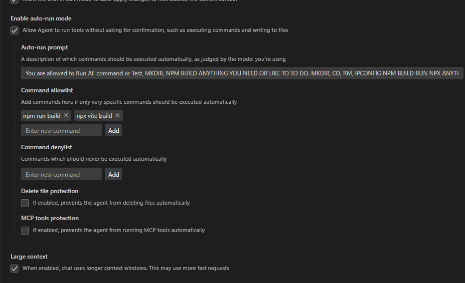
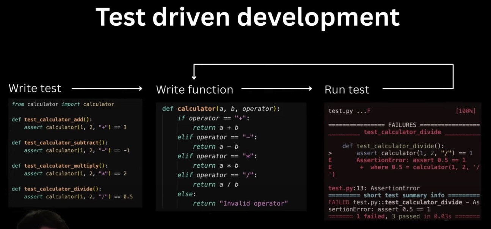
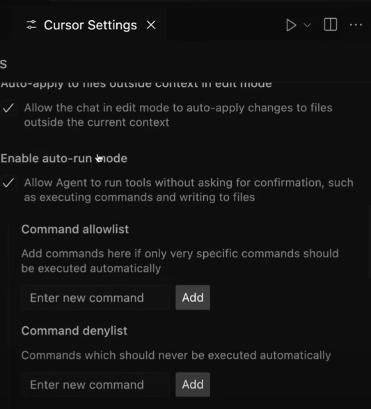
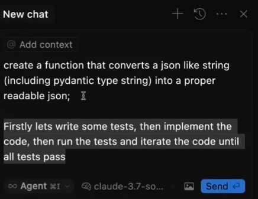

# Engineering Guidelines & Cursor Rules

This repository contains the consolidated engineering guidelines for our full-stack development team. The core of this is the `fullstack_guide.mdc` file, designed to be used as a set of rules within the [Cursor](https://cursor.sh/) IDE.

## `fullstack_guide.mdc`

This file provides a comprehensive set of rules and best practices for developing high-quality code using our technology stack:

* **Front-End:** ReactJS, JavaScript, TypeScript, TailwindCSS, HTML, CSS
* **Back-End:** Python, FastAPI, SQLModel

It ensures consistency, quality, and adherence to best practices across all our projects.

### Sources

This guide is built upon a foundation of established best practices and insights from experienced developers and resources, including:

* **Internal Best Practice Documents:** Synthesized knowledge from our existing `guide1.md`, `guide2.md`, `guide3.md`, `guide4.md`, and `guide5.md`.
* **React State Management & Hooks:** Insights from videos like:
    * [Learn useState In 15 Minutes - React Hooks Explained](https://www.youtube.com/watch?v=O6P86uwfdR0): Covering the Fundamentals and Usage of the `useState` hook in React.
    * [State Managers Are Making Your Code Worse In React](https://www.youtube.com/watch?v=VenLRGHx3D4): Discussing the evolution of state management in React, advocating for built-in tools like Context API, `useReducer`, and URL-based state over external libraries in many cases.
* **Programming Experience:** General wisdom from sources such as:
    * [5 Things I Have Learned from 10+ Years of Programming](https://www.youtube.com/watch?v=dQfqbL3GjYA): Offering key lessons learned over a decade of programming to foster a more enjoyable and effective development journey.
* **SQLModel Resources:** Best practices gathered from various web resources and documentation regarding SQLModel, FastAPI integration, and Pydantic v2.

## Using rules with Cursor

To leverage these guidelines directly within your Cursor IDE for features like `@rules` chat and code generation:

1.  **Locate/Create the Cursor Rules Directory:** In the root directory of your project, find or create a hidden directory named `.cursor`. Inside it, find or create another directory named `rules`.
2.  **Copy the Guide:** Place the `fullstack_guide.mdc` file from this repository into the `.cursor/rules/` directory.


# Guides

I created some guides with AI (Grok, Gemini, ChatGPT) using web search to compile and distill best practices and actionable advice.

You might find them useful too:

```
├── guides
│   ├── General Insights on Project Plan Templates in Dev Workflows.pdf
│   └── To maximize productivity with Cursor AI and effectively break down tasks, here are concrete tips based on best practices and insights from developers, including.pdf
```

# How to create your own cursorrules

## Preparation:

Collect a list of resources that give good advice on coding and best practices with the technologies that you are using in your project.

I went to YouTube and searched and skimmed some of the videos that made sense to me.

Then grab an example prompt that comes close to what you are trying to do. It will serve as a starter for the AI to craft your own cursor rules file. I took mine from [cursor.directory](https://cursor.directory/rules) where I selected one of the React prompts that sounded good.

Then you go to your favorite AI chat. I used Gemini 2.5 Pro because it can process YouTube links and is supposed to be great with logic and code. I don't know if that means it also gives great coding advice, but I am willing to just try it out.

## Initial prompt

```
Please watch the following video and create me a list of rules and best practices to follow.

<INSERT LINK TO YOUTUBE VIDEO #1>

Here is an example document on how to specify the rules and best practices to follow:

<INSERT CONTENT OF EXAMPLE CURSOR RULES FILE>
```

## Follow up prompt (2)

```
Great thank you very much. Please now watch this video and add the advice and tips and best practices and guidelines given to your document: [

<INSERT LINK TO YOUTUBE VIDEO #2>
```

## Follow up prompt (3)
```
Perfection! Now lets add the advice from yet another video in the same manner as before: 

<INSERT LINK TO YOUTUBE VIDEO #3>
```

## Follow up prompt (4)

I now wanted the AI to check our current results with this prompt:

```text
Please critically review the guide we've created so far. Justify every single point on why it should be in the guide. If a point is not strong enough, admit it so we can remove it to keep our guide as informative and actionable as possible! THIS IS FOR MAKING THE BEST ENGINEERS POSSIBLE!!!!!!!!!
```

## Follow up prompt (5)

And after the AI didn't find anything to remove, I asked it to create me a markdown version of the current set of rules
```
Please create me a cursorrules file from this (markdown format with yaml header)
```

## Follow up prompt (6)

When proofreading the output, I discovered something unwanted, so I followed up with a correction:

```
We need to create a revision because we will use FastAPI and Python for the backend instead of NextJS.
```

I then got an updated version in Markdown format that I could save as a cursor rules mdc file.

# Resources

You can find a [curated list of tools, plugins, and MCP servers for working with an AI powered developer workflow here](tools/README.md) 

## Cursor Editor

[cursor.directory](https://cursor.directory/rules)
[A curated list of MCP servers](https://github.com/modelcontextprotocol/servers)

## YouTube Videos:

[How I reduced 90% errors for my Cursor (+ any other AI IDE)](https://www.youtube.com/watch?v=1L509JK8p1I)
[How I reduced 90% errors for my Cursor (Part 2)
](https://www.youtube.com/watch?v=dF4uCZAY1tk)


## Workflow

### Config

How to activate/deactivate automatic tool use for specific commands via settings:



The settings might have changed in newer versions of Cursor?

Note: Auto-run has recently been renamed to YOLO mode

### Test Driven Development

Don't be the guy who just says "fix this" in a loop.

Instead: Write the test first, get the AI to iterate on the implementation of the function until the test passes

Or even better: Turn on YOLO mode, ask to write the test, write the function and iterate fixing the function.



YOLO mode needs to be activated first in settings



Here is an example TDD prompt. You should add an example input and expected output as well to help the AI develop what you want it to.



### Memory Bank

The idea of the memory bank was first (?) documented by cline (another AI editor) in [The Complete Guide to Cline Memory Bank](https://docs.cline.bot/prompting/cline-memory-bank)
