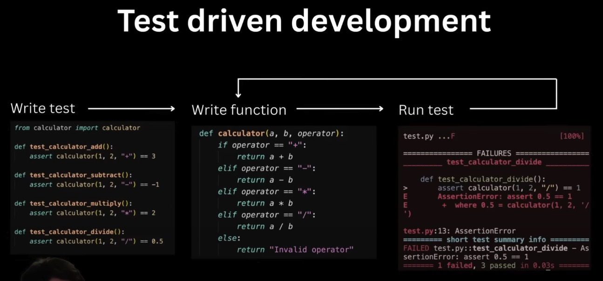
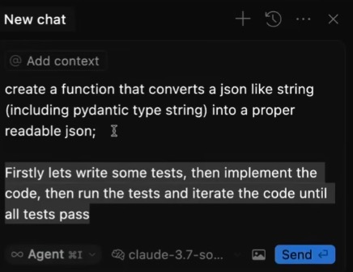

# ⚙️ Cursor Settings & Configuration

Optimize your Cursor AI editor settings for maximum productivity and reduced errors.

## 📁 Contents

- **[images/](images/)** - Screenshots and visual guides
- **[yolo-mode.md](yolo-mode.md)** - YOLO mode configuration and usage
- **[auto-run-settings.md](auto-run-settings.md)** - Automatic tool execution settings

## 🎮 YOLO Mode

YOLO mode (formerly called Auto-run) allows Cursor to automatically execute commands and tools, dramatically speeding up your development workflow.

### How to Activate

1. Open Cursor settings
2. Navigate to the auto-run/YOLO mode section
3. Enable automatic tool use for specific commands

**Note:** Auto-run has recently been renamed to YOLO mode in newer versions of Cursor.

## 🔧 Configuration Tips

### Automatic Tool Use

How to activate/deactivate automatic tool use for specific commands via settings:

**Important:** The settings might have changed in newer versions of Cursor, so check the latest documentation.

## 🧪 Test-Driven Development Setup

Configure Cursor for optimal TDD workflows:

## 💡 Best Practices

- **Start Conservative** - Begin with limited auto-run permissions
- **Test Thoroughly** - Verify settings work with your workflow
- **Stay Updated** - Settings and features evolve with Cursor updates
- **Backup Settings** - Export your configuration for easy restoration

## 🔗 Related Resources

- [Prompting Strategies](../../prompting/) - Learn effective prompting techniques
- [Cursor Rules](../cursor-rules/) - Set up rules for consistent behavior
