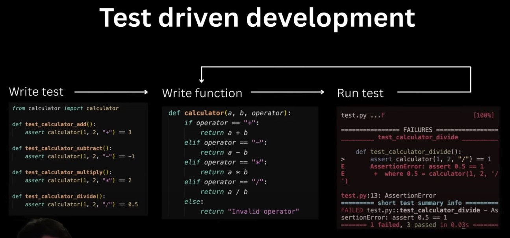
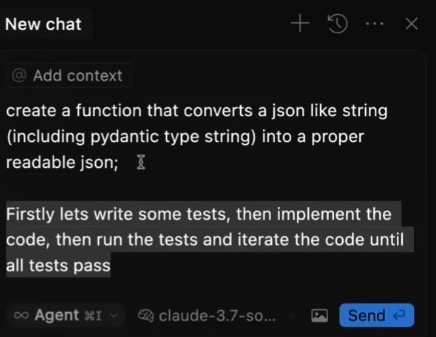

# 🧪 Test-Driven Development with AI

Learn how to use AI coding assistants effectively with test-driven development practices.

## 🎯 The Problem

Don't be the guy who just says "fix this" in a loop.

## ✅ The Solution

Instead: Write the test first, get the AI to iterate on the implementation of the function until the test passes.

Or even better: Turn on YOLO mode, ask to write the test, write the function and iterate fixing the function.

## 🚀 TDD Workflow with AI

1. **Write the test first** - Be specific about what you want
2. **Ask AI to implement** - Let the AI create the initial implementation
3. **Run the test** - See if it passes
4. **Iterate** - If it fails, ask AI to fix based on test results
5. **Refine** - Continue until test passes

## 💡 Example TDD Prompt

Here's an example TDD prompt structure. You should add an example input and expected output as well to help the AI develop what you want it to.

```
I need a function that [describe what it should do].

Input example: [provide specific input]
Expected output: [provide expected result]

Please:
1. First write a test for this function
2. Then implement the function
3. Make sure the test passes
```

## 🎮 YOLO Mode

YOLO mode needs to be activated first in settings. This allows the AI to automatically run commands and tests, speeding up the TDD cycle.

## 🔧 Benefits

- **Faster iteration** - AI can quickly implement and fix
- **Better code quality** - Tests ensure functionality
- **Clear requirements** - Tests serve as specifications
- **Reduced debugging** - Catch issues early

## 📸 Visual Guide



